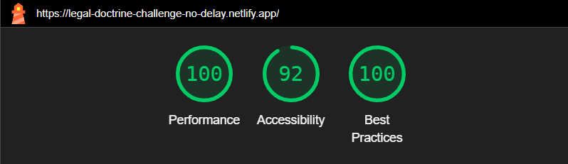
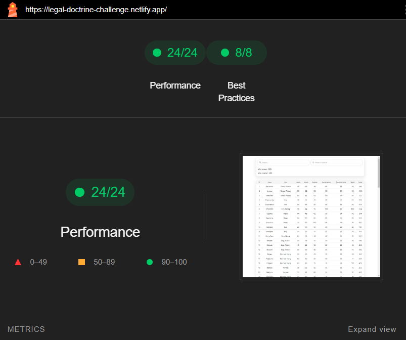

# Legal Doctrine challenge
---

## 📖 Table of Contents

- [📖 Table of Contents](#table-of-contents)
- [📍 Overview](#overview)
- [🤖 Features](#-features)
- [🚀 Performance](#-performance)

---
## 📍 Overview
Completed Legal Doctrine assignement. 

🌐 Live app: <a href="https://legal-doctrine-challenge.netlify.app/" target="_blank">**Demo : legal-doctrine-challenge.netlify.app**</a>

Stack:
- ReactJS
- Sass

---

## 🤖 Features
**:red_circle: Required :**
- :white_check_mark: Data fetching from **pokemon.json** file.
- :white_check_mark: Added **Power column**.
- :white_check_mark: Interactive pagination : ***Page navigation*** and ***Page size control***.
- :white_check_mark: Search by **Pokemon Name**.
- :white_check_mark: Search by **Power Threshold**.

**🎁 Bonus :**
- :white_check_mark: Data Caching.
- :white_check_mark: Loading skeletons.
- :white_check_mark: Responsive view.
- :white_check_mark: Reusable Custom Hooks.
- :white_check_mark: No match message.
- :white_check_mark: Error message.
- :white_check_mark: Clear Search field button.
- :white_check_mark: Autonavigate pagination on search.

## 🚀 Performance

### 🚨 Lighthouse scores

### Page load score

### Timespan score

