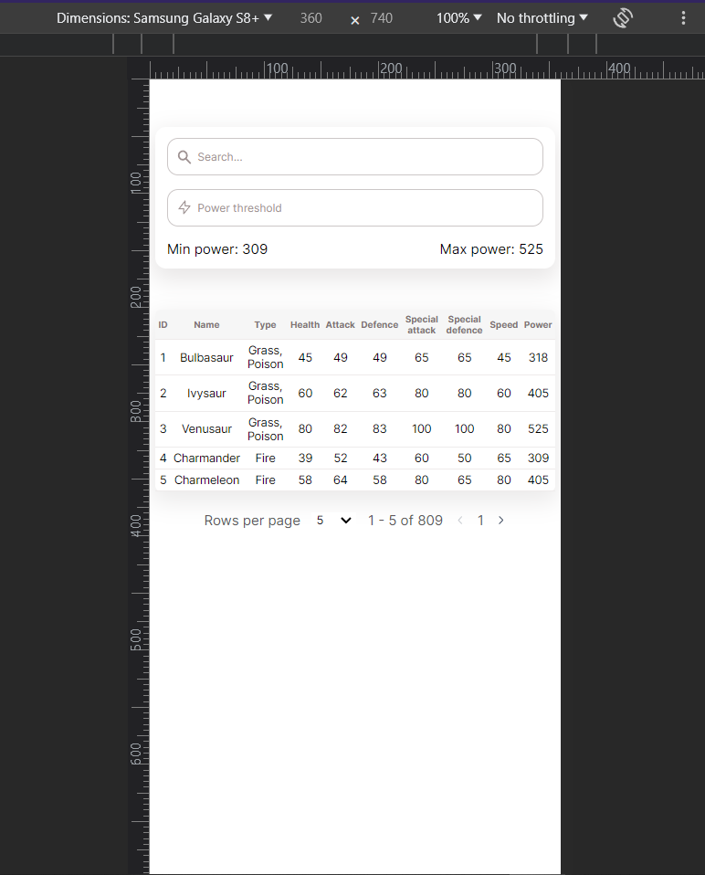
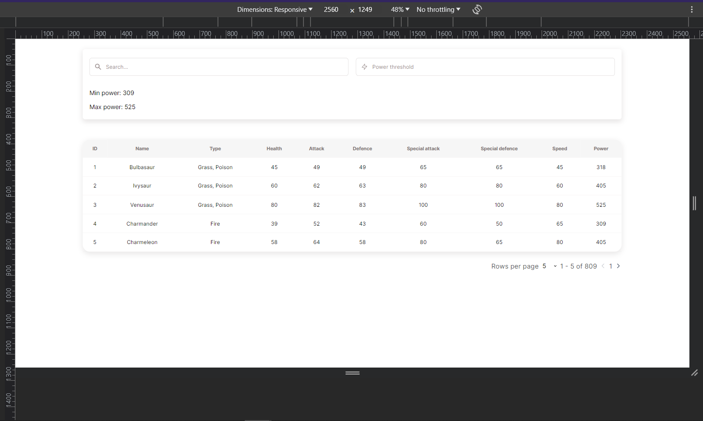

# Legal Doctrine challenge
---

## 📖 Table of Contents

- [📖 Table of Contents](#-table-of-contents)
- [📍 Overview](#-overview)
- [🤖 Features](#-features)
- [🚀 Performance](#-performance)
- [📜 App responsiveness](#-app-responsiveness)
- [💡 Solution review and possible improvements](#-solution-review-and-possible-improvements)

---
## 📍 Overview

Completed Legal Doctrine assignement including all required tasks and extra features added for a better user experience. The solution tries to follow the SOLID principles and implements ReactJS best practices.

🌐 Live app: <a href="https://legal-doctrine-challenge.netlify.app/" target="_blank">**Demo : legal-doctrine-challenge.netlify.app**</a>

Stack:
- ReactJS
- Sass

---

## 🤖 Features
**:red_circle: Required :**
- :white_check_mark: Data fetching from **pokemon.json** file.
- :white_check_mark: Added **Power column**.
- :white_check_mark: Interactive pagination : ***Page navigation*** and ***Page size control***.
- :white_check_mark: Search by **Pokemon Name**.
- :white_check_mark: Search by **Power Threshold**.

**🎁 Bonus :**
- :white_check_mark: Data Caching.
- :white_check_mark: Loading skeletons.
- :white_check_mark: Responsive view.
- :white_check_mark: Reusable Custom Hooks.
- :white_check_mark: No match message.
- :white_check_mark: Error message.
- :white_check_mark: Clear Search field button.
- :white_check_mark: Autonavigate pagination on search.

---

## 🚀 Performance

### 🚨 Lighthouse scores

### Navigation score

The default Lighthouse test mode, it evaluates the page loading speed, rendering efficiency, accessibility and other metrics. 

The analysis score is described in the image below and it shows that the app is quite performant on page load thanks to the implemented caching and loading skeletons.

### Timespan score

Another test mode, the timespan mode focuses on analyzing the app's reactivity towards the user interactions during a recorded session.

To fairly assess the app's performance, I applied all the possible interactions on the page :
- Searching
- Navigating through pages.
- Changing pagination size.

The obtained scores are depicted below. The app scored the highest possible scores through the test session.

### Caching

The caching strategy I used is the Session storage caching available through the [Web Storage API](https://developer.mozilla.org/en-US/docs/Web/API/Web_Storage_API/Using_the_Web_Storage_API).

The choice of this mechanism boils down to :
- Implementation simplicity : the implementation is simple and straight forward.
- Short life cycle of the storage: since it's session based, this approach provides performance enhancement without having to manage the cache maintenance.
  
### Debouncing

While building the **Search functionality** I attempted to debounce changing the table results on each key stroke, after implementing the debouncing it turned out it causes more component rerenders without a significant improvement in performance, so discarded the idea.

## 📜 App responsiveness

I made sure to make the app responsive, it supports a mobile view of a minimum width of 360px up to a 4K screen.

### 📱 Mobile screen 

### 🖥️ 4K screen 

---

## 💡 Solution review and possible improvements

This solotion was conceived with reusability and performance in mind, however there's still space for improvements:

❌ Fetching data inside useEffect hook is considered a bad practice and should be avoided when possible see: [You might not need an Effect](https://react.dev/learn/you-might-not-need-an-effect), react-query is a great alternative however I didn't want to cumbersome the project with 3rd party library and over-engineer a small project.

Using state management library or ContextAPI: the app state grew rapidly and required a lot of *state lifting* and the App.jsx component became crowded with different states, ContextAPI was a choice at hand but I saw that the state was still manageable therefore avoided using it since it drags down components reusability.

Implementing [useDifferedValue](https://react.dev/reference/react/useDeferredValue) hook could be opted for if the data was large enough.

